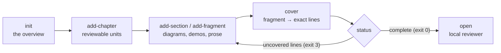

# Change Saga

**A large change should not arrive at full density all at once.** Change Saga is
a Git-native way to *author* that change so a reviewer meets it gradually — an
overview, then chapters, then the exact lines — and it mechanically proves that
no changed line was left out of the story.

[](https://github.com/change-saga/change-saga/actions/workflows/ci.yml)
[](https://github.com/change-saga/change-saga/actions/workflows/e2e.yml)


> [!WARNING]
> Early scaffold. The v2 format is experimental and there is no compatibility
> promise yet. Good for local trials; not yet for load-bearing process.

## Why

A 6,000-line pull request is delivered to its reviewer as a flat list of files
in alphabetical order, preceded by a paragraph of prose that nobody can verify.
Density goes from zero to maximum in one click. The reviewer has no way to build
context before being asked to judge details, and no way to know which details
the description quietly skipped.

Everything a reviewer actually needs is a **gradient**:

| | Answers | Verified against the diff? |
| --- | --- | --- |
| Overview | Why does this change exist? | — |
| Chapter | What would this have been if we'd split the PR? | yes, per chapter |
| Section / fragment | How does this part behave? Show me. | yes, per fragment |
| Diff link | Which exact lines implement it? | yes, exactly |

A **Change Saga** is that gradient, stored as ordinary files in Git. It is a
`*.saga/` directory of fragments — Markdown, SVG, images, plain text, or fully
interactive HTML packages with JavaScript — organized into chapters that are
roughly the PRs that might have existed had the work been split. Every fragment
can link to exact line ranges in the source comparison, and `change-saga status`
fails until every changed line is reachable from somewhere in the story.

### What this is not

Change Saga **authors the material to be reviewed**. It is the successor to the
PR description and the flat diff — the thing submitted for review.

It does **not** review code. It produces no findings, no verdicts, no automated
approvals, and no "AI reviewer" opinions. When an AI agent uses the bundled
skill, it acts as the *change author*: it writes the explanation, builds the
demonstrations, and maps them to code. Judging the change stays with people.

It also does not replace Git hosting, enforce review policy, or decide whether
an explanation is any good. Coverage is an omission check, not a quality score.

## How it works



Authors loop between explaining and covering. The tool never guesses which
narrative explains which lines; it only reports what is still unaccounted for.

## Install

Binaries are published on the [GitHub Releases page][releases] for macOS,
Linux, and Windows (amd64 and arm64). Both installers detect the OS and
architecture, download the matching asset from the latest release, and verify it
against that release's `SHA256SUMS`.

**macOS and Linux**

```sh
curl -fsSL https://raw.githubusercontent.com/change-saga/change-saga/main/scripts/install.sh | sh
```

Installs to `~/.local/bin` and never calls `sudo`. Options go after `-s --`:

```sh
curl -fsSL .../install.sh | sh -s -- --version <tag> --dir ~/bin
```

**Windows PowerShell**

```powershell
irm https://raw.githubusercontent.com/change-saga/change-saga/main/scripts/install.ps1 | iex
```

Installs under the current user's local application data directory and adds it
to the user `PATH`. It never requests elevation. To pin a version, download the
script first:

```powershell
irm https://raw.githubusercontent.com/change-saga/change-saga/main/scripts/install.ps1 -OutFile install.ps1
.\install.ps1 -Version <tag>
```

**By hand.** Download the archive for your platform from the
[releases page][releases], then verify before unpacking:

```sh
sha256sum -c SHA256SUMS --ignore-missing
gh attestation verify change-saga_<version>_linux_amd64.tar.gz --repo change-saga/change-saga
```

Every release archive is covered by `SHA256SUMS` and by a GitHub build
provenance attestation. macOS builds are signed and notarized when release
signing is configured; each release's notes say which applies. See
[docs/releasing.md](docs/releasing.md).

**From source**, with Go 1.26 or newer:

```sh
git clone https://github.com/change-saga/change-saga
cd change-saga
go build -o ./bin/change-saga ./cmd/change-saga
./bin/change-saga help
```

Once the project is published at its module path,
`go install github.com/change-saga/change-saga/cmd/change-saga@latest` will work
as well. While developing in this repository, `go run ./cmd/change-saga help` is
equivalent to the built binary.

[releases]: https://github.com/change-saga/change-saga/releases

## Your first saga

Run this from a checkout of the repository you are proposing a change to, on the
branch that holds the change.

**1. Create the saga** for the comparison between `main` and your branch:

```sh
change-saga init --base main --head HEAD --title "Checkout rewrite" pr-1234.saga
```

**2. Give the change its shape.** Chapters are the independently reviewable
units; sections and fragments recurse inside them:

```sh
change-saga add-chapter --title "Backend behavior" pr-1234.saga backend
change-saga add-section --title "Request flow" pr-1234.saga backend.chapter/request-flow
change-saga add-fragment --section backend.chapter/request-flow --type html \
  --title "Try the request flow" pr-1234.saga
```

`--type` accepts `markdown` (the default), `html`, `svg`, `image`, or `text`. To
import a complete interactive package, pass its directory; `index.html` is the
default entrypoint and `--entrypoint` overrides it:

```sh
change-saga add-fragment --section backend.chapter/request-flow --type html \
  --source ./review-demos/request-flow --entrypoint index.html pr-1234.saga
```

**3. Ask what is still unexplained:**

```sh
change-saga status pr-1234.saga
```

```text
INCOMPLETE — 0/70 product changes accounted for
Uncovered: 70  Overlapping: 0  Stale URIs: 0  Saga-only changes: 0
```

`--json` emits the same result machine-readably, listing every uncovered diff
atom with its stable URI — the form an authoring agent consumes.

**4. Attach evidence** until nothing is left over. Each `cover` call says "this
part of the story explains these exact lines":

```sh
change-saga cover \
  --target backend.chapter/request-flow/try-the-request-flow.fragment \
  --path internal/checkout/handler.go \
  --side new \
  --lines 18-42,57-63 \
  --note "HTTP entry point and validation" \
  pr-1234.saga
```

Deleted lines use `--side old`. A pure file event is covered with, for example,
`--event rename --old-path old.go --new-path new.go`.

**5. Read it the way a reviewer will:**

```sh
change-saga status pr-1234.saga   # COMPLETE — 70/70 product changes accounted for
change-saga open pr-1234.saga     # local reviewer at http://127.0.0.1:7342
```

`status` exits **3** while coverage is incomplete, which makes it usable as an
authoring loop condition or a CI gate. `validate` checks only on-disk structure
and exits **1** for schema errors. Run `change-saga help`, or
`change-saga <command> -h`, for the full flag set.

Sagas in a separate repository from the code are supported: pass
`--repo /path/to/source-checkout` to `cover`, `status`, and `open`.

## Reviewing

`change-saga open` starts a local, loopback-only reviewer with three
complementary surfaces over the same records:

- **Saga** keeps the authored narrative in the foreground and opens attached
  code in a scrollable drawer. Files start collapsed with their authored
  what-and-why summary; expanding one reveals only the ranges linked to that
  part of the story.
- **Code Diff** presents the entire comparison with a changed-file tree, for
  when a reviewer wants the traditional view.
- **Manifest** audits the mapping in both directions: every changed range shows
  which parts of the saga explain it, and every mapped element shows its exact
  ranges.

Reviewers can draw rectangles and freehand shapes, highlight exact text, place
sticky notes, reply with fragments (Markdown, images, SVG, or interactive HTML
rather than one text field), mark files reviewed, and approve at saga, chapter,
section, or fragment level. Committed annotations stay live objects: they can be
selected, moved, reworded, recolored, or removed.

The review overlay is deliberately conflict-resistant. Each comment is its own
`.thread` directory, each reply its own `.message` directory, and each state or
approval transition a new event file. Nothing ever updates a shared comments
array, so two reviewers working at once merge cleanly. Removing a comment
appends a `withdrawn` event rather than deleting history, and identity comes
from the Git committer of the introducing commit — the reviewer is never asked
to log in.

Automated readers use the structured, read-only query boundary instead of
discovering saga metadata paths. Every invocation writes exactly one
`change-saga.ai/v1` JSON envelope and uses stable exit codes:

```sh
change-saga query overview --saga pr-1234.saga
change-saga query children --saga pr-1234.saga --parent urn:change-saga:checkout:saga
change-saga query fragment --saga pr-1234.saga --target urn:change-saga:checkout:fragment:request-flow
change-saga query gaps --saga pr-1234.saga --kind uncovered
```

Run `change-saga query --help` for the complete operation list. Pass `--repo`
when the source checkout is separate from the saga repository.

## AI-guided authoring

Print a portable prompt that asks the coding agent you already use to install
the project-local authoring skill through its own native mechanism:

```sh
change-saga install-skill
```

The command writes no files and assumes no particular agent layout (Claude Code,
Codex, OpenCode, or otherwise). Paste its output into the agent working in your
target repository. The installed skill preserves that repository's normal
PR-drafting process and expresses the result as a visual, coverage-complete
Change Saga. It explicitly authors the artifact submitted for review; it does not
conduct the review or produce review feedback.

This repository also keeps the full reference
[`change-saga` skill](skills/change-saga/SKILL.md) used to develop that portable
contract, and `change-saga spec` prints the machine-readable contract vocabulary.

## What a saga looks like on disk

```text
pr-1234.saga/
├── saga.json
├── ___diffs/
├── ___approvals/
├── ___review/
│   ├── diffs/
│   │   └── review-event.json
│   └── threads/
│       └── thread-id.thread/
│           ├── thread.json
│           ├── events/
│           └── messages/
├── overview.fragment/
│   ├── fragment.json
│   └── content.md
└── backend.chapter/
    ├── chapter.json
    ├── overview.fragment/
    └── request-flow/
        ├── section.json
        └── interactive-demo.fragment/
            ├── fragment.json
            ├── index.html
            ├── app.js
            ├── ___landmarks/
            │   └── submit-action.landmark/
            │       ├── landmark.json
            │       └── ___diffs/
            └── ___diffs/
```

Every root `.chapter` directory is an independent review boundary, every
ordinary nested directory is a section, and every `.fragment` directory is an
atomic content package. Markdown headings carry explicit `{#stable-anchor}`
markers; addressable HTML/SVG elements, exact text runs, and image regions get
their own `___landmarks/<id>.landmark/` packages so a single sentence or a single
drawn box can point at exact code.

Each evidence record contains a `saga-diff://v1/...` URI carrying the absolute
source repository URI, the resolved base identity, and a stable digest of the
product patch. Commits that only touch the `*.saga/` directory do not invalidate
that digest, so writing the story never invalidates the story's own links.

[SPEC.md](SPEC.md) is the format contract; the JSON Schemas live in
[`schema/`](schema).

## Security

The reviewer is a local tool. It **refuses to bind to anything but loopback**,
validates the request `Host`, rejects cross-origin requests, and requires a
per-process token for every mutating request. It has no user accounts and no
authentication — anyone who can reach the port can act as you, which is exactly
why it will not listen on one that others can reach.

Interactive fragments run in sandboxed frames with scripts enabled but network
access and access to the parent review application denied. Fragments are still
untrusted content from whoever authored the saga: review a saga the way you'd
review any branch you are about to check out.

Full model and reporting process: [SECURITY.md](SECURITY.md).

## Project

| | |
| --- | --- |
| Format contract | [SPEC.md](SPEC.md), [`schema/`](schema) |
| All documentation | [docs/](docs/README.md) |
| Contributing | [CONTRIBUTING.md](CONTRIBUTING.md) |
| Code of conduct | [CODE_OF_CONDUCT.md](CODE_OF_CONDUCT.md) |
| Getting help | [SUPPORT.md](SUPPORT.md) |
| Security reports | [SECURITY.md](SECURITY.md) |
| Decisions and maintainership | [GOVERNANCE.md](GOVERNANCE.md) |
| Release history | [CHANGELOG.md](CHANGELOG.md) |

The implementation is a single static Go binary with no runtime dependencies and
no hosted service: there is nothing to sign up for, and nothing leaves your
machine.

## License

MIT. See [LICENSE](LICENSE).
